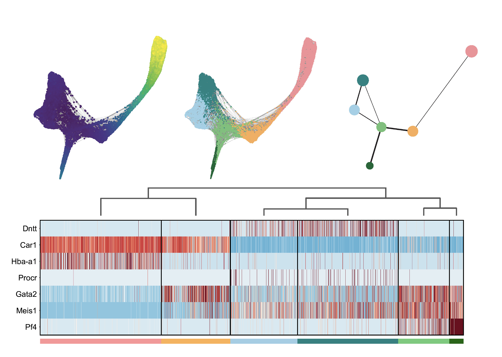
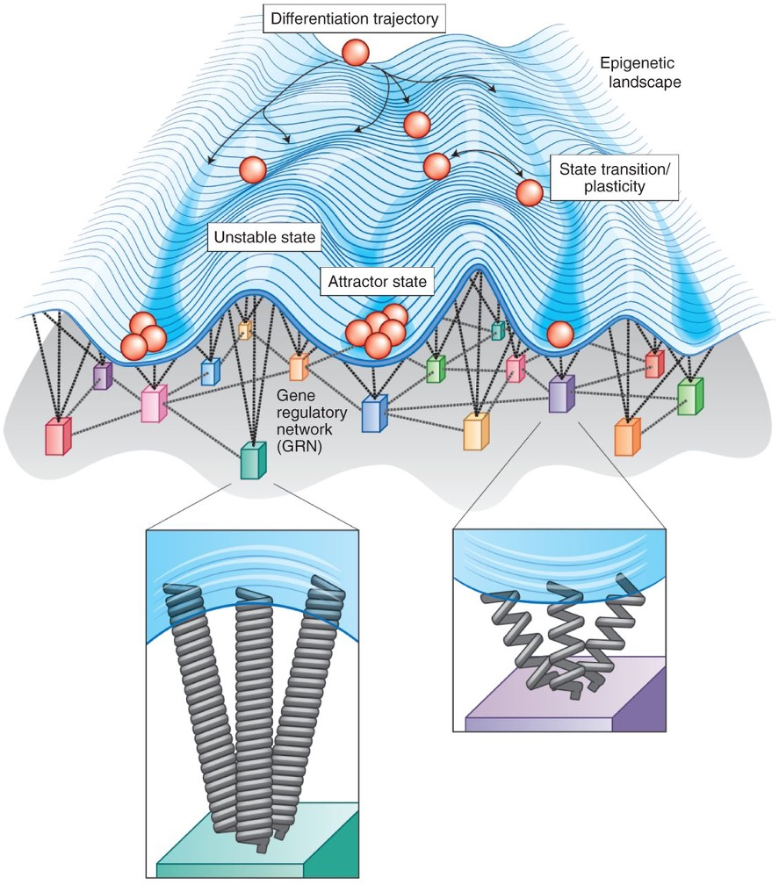
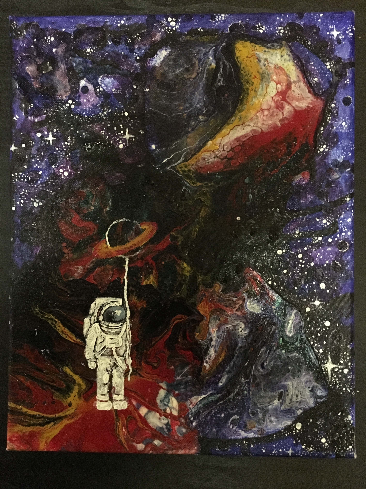
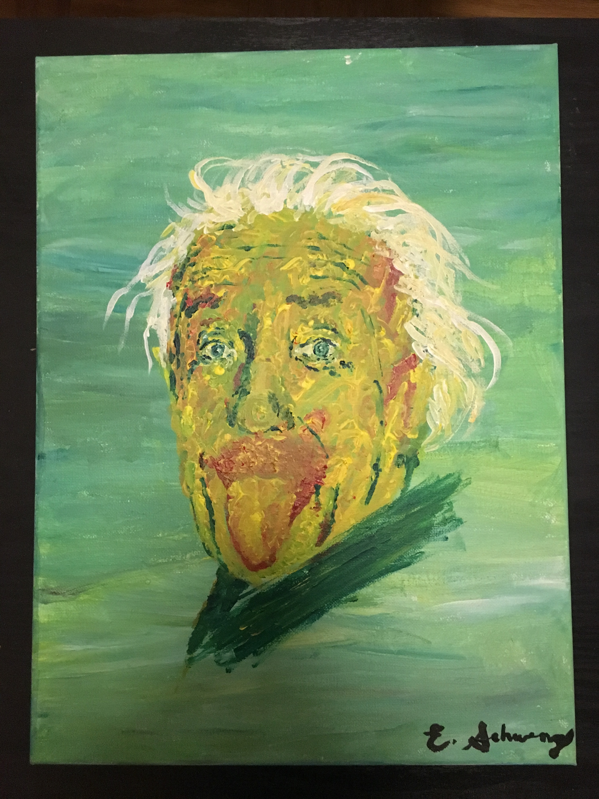
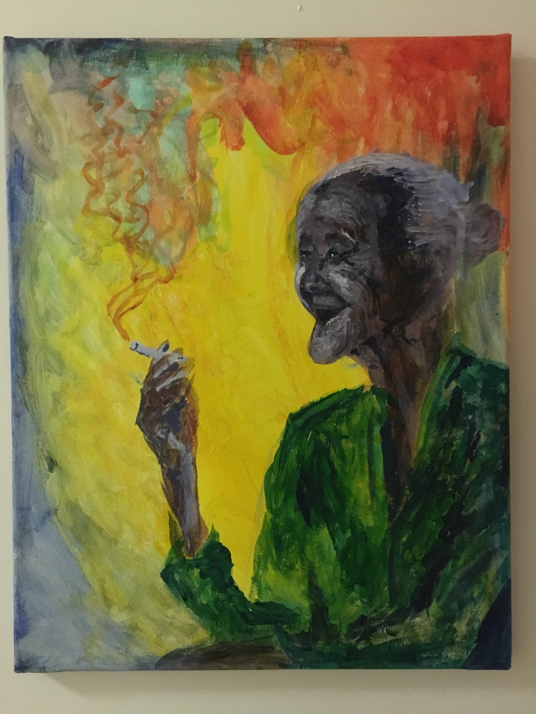
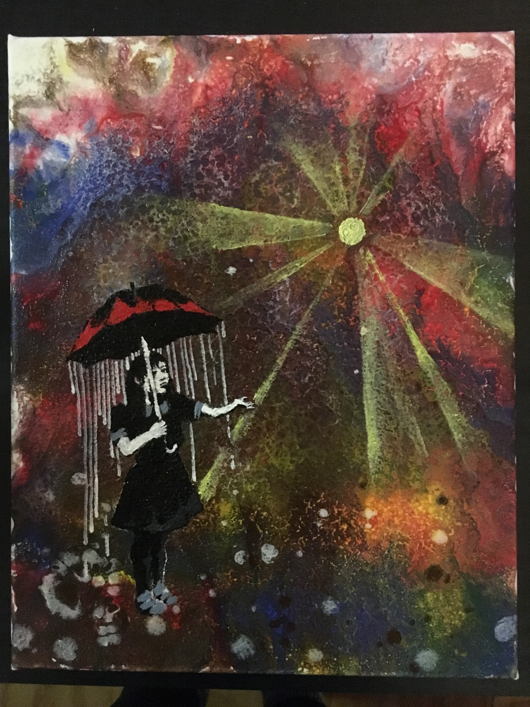
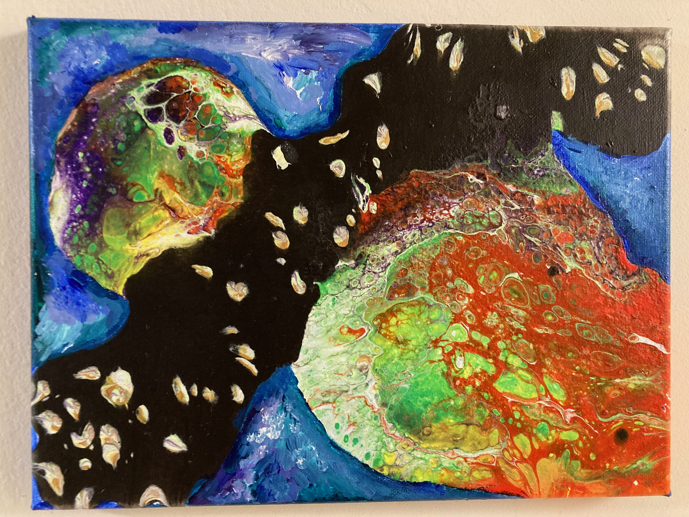

```{r setup, include=FALSE}
knitr::opts_chunk$set(echo = TRUE, 
                      warning = FALSE, 
                      message = FALSE) 

suppressPackageStartupMessages( {
  library(ggplot2)
  library(plotly)
  library(RColorBrewer)
  library(tidyverse)
} )
```

# About ***"me"***

"Learn from yesterday, live for today, hope for tomorrow. The important thing is not to stop questioning."

  **-Albert Einstein**

## Research Interests

I am an MD/PhD candidate at the Albert Einstein College of Medicine studying clonal competition in cancers of the blood (a.k.a. hematopoietic system), specifically myelodysplastic syndromes (MDS) and acute myeloid leukemias. I am currently modeling the systems-level properties and dynamics of the hematopoietic system that determine clonal expansion in del(5q) MDS patients; in particular, how the extrinsic effects of T-cell killing due to neoantigenicity of mutations and available hematopoietic stem cell niche space contribute to net fitness of a given clone. 

My long-term interests lie in studying the greater system mechanisms that ensure that disease-causing clonal evolution does *not* occur for most of life despite the constant onslaught of mutations and genotoxic exposures, rather than mitigating advanced and highly evolved disease. I can only hope to help humanity in some way, perhaps through bridging the gap between healthcare and computer science, focusing on applied machine learning in healthcare; or maybe through some unexpected path that emerges, working on diverse projects across a variety of domains but connected by common threads in systems biology, evolutionary theory, network analysis, or information theory.

{width=300px}

# Publications


1.	Piszczatowski RT\*, __Schwenger E__\*, Sundaravel S, Stein CM, Liu Y, Stanley P, Verma A, Zheng D, Seidel RD, Almo SC, Townley RA, Bülow HE, Steidl U. A glycan-based approach to cell characterization and isolation: Hematopoiesis as a paradigm. J Exp Med. 2022 Nov 7;219(11):e20212552. doi: 10.1084/jem.20212552. Epub 2022 Sep 6. 
_*Authors contributed equally to this work_
  
2.	__Schwenger E__, Steidl U. An evolutionary approach to clonally complex hematologic disorders. Blood Cancer Discov. 2021 May;2(3):201-215. doi: 10.1158/2643-3230.BCD-20-0219. Epub 2021 Apr 15. 

3.	Ueda K, Kumari R, __Schwenger E__, Wheat JC, Bohorquez O, Narayanagari SR, Taylor SJ, Carvajal LA, Pradhan K, Bartholdy B, Todorova TI, Goto H, Sun D, Chen J, Shan J, Song Y, Montagna C, Xiong S, Lozano G, Pellagatti A, Boultwood J, Verma A, Steidl U. MDMX acts as a pervasive preleukemic-to-acute myeloid leukemia transition mechanism. Cancer Cell. 2021 Apr 12;39(4):529-547.e7. doi: 10.1016/j.ccell.2021.02.006. Epub 2021 Mar 4. 

4.	__Schwenger E__, Reddy VP, Moorthy G, Sharma P, Tomkinson H, Masson E, Vishwanathan K. Harnessing Meta-analysis to Refine an Oncology Patient Population for Physiology-Based Pharmacokinetic Modeling of Drugs. Clin Pharmacol Ther. 2018 Feb;103(2):271-280. doi: 10.1002/cpt.917. Epub 2017 Nov 20. 

5.	Mbogning J, Pagé V, Burston J, __Schwenger E__, Fisher RP, Schwer B, Shuman S, Tanny JC. Functional interaction of Rpb1 and Spt5 C-terminal domains in co-transcriptional histone modification. Nucleic Acids Res. 2015 Nov 16;43(20):9766-75. doi: 10.1093/nar/gkv837. Epub 2015 Aug 14.

## Figures



{width=600px}


# Paintings

“Art washes away from the soul the dust of everyday life.”  __-Pablo Picasso__

{width=400px} {width=400px}

{width=400px} {width=400px}




# Notes

"Calculus required continuity, and continuity required the idea of the infinitely little, but nobody could discover what the infinitely little might be." 

  **-Bertrand Russell**

## Formulas

### Euler's formula

$e^{i\pi}=-1$

### Taylor series raised to power of a matrix $\mathbf{A}$

$e^{\mathbf{A}}=\mathbf{A}^0 + \mathbf{A}^1 + \dfrac{1}{2}\mathbf{A}^2 + \dfrac{1}{6}\mathbf{A}^3 + \dfrac{1}{24}\mathbf{A}^4 + ... + \dfrac{1}{n!}\mathbf{A}^n=$ stable matrix.

### Schrödinger Equation, $i\hslash\dfrac{\delta}{\delta t}|\psi\rangle=H|\psi\rangle$

THe Schrödinger equation in all its glory:

\begin{aligned}
i\hslash\dfrac{\delta}{\delta t}|\psi\rangle=H|\psi\rangle
\end{aligned}, where $|\psi\rangle$ is the *state* of the system as a *vector* (of important parameters such as *position* and *momentum*).

## Plots

### Bifurcation plot $f(x)=rx(1-x)$

```{r, echo=FALSE, message=FALSE}
x_vec <- NULL
iter_logit <- function(n, r, x0) {
  x <- x0
  ## iterate logistic function n times
  for(i in 1:n) {
    x1 <- r*x*(1-x)
    x_vec[i] <- x1
    x <- x1
  }
  x_vec <- c(x0, x_vec)
  return(x_vec)
}

## plot overlapping curves
n <- 1e3
n_excl <- 200 # how many initial points to exclude before stability is reached
#r <- 2.4

rvals <- seq(from=0, to=4, by=0.01)
mat_logit <- matrix(data=NA, nrow=n-n_excl, ncol=length(rvals))
colnames(mat_logit) <- rvals
for(i in 1:length(rvals)){
  r <- rvals[i]
  mat_logit[,i] <- iter_logit(n, r, 0.2)[-c(1:(n_excl+1))]
}

#mat_logit[1:5, 1:20]
```

```{r, fig.width=20, fig.height=10, echo=FALSE}
## convert data to long format
dat_long <- mat_logit %>% 
  as_tibble() %>%
  rownames_to_column("id") %>%
  gather(conditions, values, -id) %>%
  mutate(r=as.numeric(conditions))

## plot
ggplot(data=dat_long, aes(x=r, y=values)) +
  geom_point(size=0.1, color="navy") +
  ggtitle("Logistic map bifurcation plot") +
  ylab("x") +
  theme_classic()
```

### Lorenz attractor

```{r, echo=FALSE}
### function for lorenz attractor system of ODEs ###
lorenz <- function(t_max, x0, y0, z0, sigma, rho, beta) {
  ## initialize variables with seeds
  x <- x0
  y <- y0
  z <- z0
  
  ## initialize vectors to add iterates
  x_vec <- x
  y_vec <- y
  z_vec <- z
  
  ## time steps, need to be sufficiently small for smooth curve
  dt <- 0.0001
  t <- seq(from=0, to=t_max, by=dt)

  for(i in 2:length(t)) {
    ## calculate derivatives based on given differential equations
    xdot <- sigma*(y-x)
    ydot <- x*(rho-z)-y
    zdot <- x*y-beta*z
    
    ## update n+1 with Euler's method (approximation)
    # can also use Runge-Kutta here
    x <- x+xdot*dt
    y <- y+ydot*dt
    z <- z+zdot*dt
    
    x_vec[i] <- x
    y_vec[i] <- y
    z_vec[i] <- z
  }
  # compile results into single dataframe
  df <- data.frame("time"=t,
                   "x"=x_vec, 
                   "y"=y_vec,
                   "z"=z_vec)
  return(df)
}

### chaotic solution ###
s <- 10
r <- 30
b <- 8/3

res <- lorenz(t_max=15, x0=10, y0=10, z0=10,
       sigma=s, rho=r, beta=b)

# 3d plot
scene = list(camera = list(eye = list(x = -1.25, y = 1.25, z = 1.25)))

plot_ly(res, x = ~x, y = ~y, z = ~z, type = 'scatter3d', mode = 'lines', #'lines+markers',
        line = list(width = 6, color = ~time, colorscale = 'Viridis'),
        #colorscale = list(c(0,'#BA52ED'), c(1,'#FCB040'))
        #marker = list(size = 3.5),
        color = ~time, 
        colorscale = 'Greens', 
        cmin = -20, 
        cmax = 50) %>% 
  layout(title = "Lorenz attractor", scene = scene)

```


### Taylor Expansion, $cos(x)$

```{r, echo=FALSE}
## initiate x
x <- seq(-10,10,by=0.2)

## plot
n <- 11
pal <- brewer.pal(11, name="Spectral")
plot(x, cos(x), type="l", col=pal[[7]], lwd=3, ylim=c(-pi,pi))
lines(x, -sin(x), col=pal[[6]])
lines(x, -cos(x), col=pal[[5]])
abline(h=0, v=0, lwd=2)
abline(v=pi, lty=2)
abline(v=-pi, lty=2)

# original solution is 1
abline(h=1, col=pal[[n]], lwd=2)

# 1st derivative solution is 0
abline(h=0, col=pal[[n-1]], lwd=2)

# 2nd derivative solution is -1
abline(h=-1, col=pal[[n-2]], lwd=2)

# taylor expansion
lines(x, (1-(0.5*x^2)), col=pal[[1]], lwd=2)
lines(x, (1-(0.5*x^2)+(1/6)*x^3), col=pal[[2]], lwd=2) # add 3rd term, 1/6 b/c 3*2*1=6
lines(x, (1-(0.5*x^2)+(1/24)*x^4), col=pal[[3]], lwd=2) # add 4th term, 1/24 b/c 4*3*2*1=24
```

### Fourier Transform, $\dfrac{cosn\pi x}{n}$

```{r, echo=FALSE}
# fourier_step <- function(x, n_iter) {
#   odd_seq <- seq(1, (n_iter*2-1), by=2)
#   for( i in 1:(n_iter-1) ) {
#     assign( paste0("fun_",i), cos(odd_seq[i]*pi*x)/odd_seq[i], envir = .GlobalEnv )
#   }
#   fun_all <- NULL
#   # if i is odd, add
#   n_odds <- odd_seq[c(TRUE,FALSE)]
#   name_odds <- paste0("fun_", n_odds)
#   vec_odds <- lapply(name_odds, get)
#   # if i is even, subtract
#   n_evens <- odd_seq[c(FALSE,TRUE)]
#   name_evens <- paste0("fun_", n_evens)
#   vec_evens <- lapply(name_evens, get)
#   return(vec_evens)
# }

# fourier_step(2, 2)

x <- seq(0, 1, length.out=1e3)
par(font.lab = 2)
plot(x, cos(1*pi*x)/1, type="l", lwd=3.1, col=pal[1], main="Fourier Transform", ylab=expression(cos(n*pi*x)/n))
abline(h=0, v=0, lwd=3)
lines(x, (cos(1*pi*x)/1)-(cos(3*pi*x)/3), type="l", lwd=3, col=pal[2])
lines(x, (cos(1*pi*x)/1)-(cos(3*pi*x)/3)+(cos(5*pi*x)/5), type="l", lwd=2.9, col=pal[3])
lines(x, (cos(1*pi*x)/1)-(cos(3*pi*x)/3)+(cos(5*pi*x)/5)-(cos(7*pi*x)/7), type="l", lwd=2.8, col=pal[4])
lines(x, (cos(1*pi*x)/1)-(cos(3*pi*x)/3)+(cos(5*pi*x)/5)-(cos(7*pi*x)/7)+(cos(9*pi*x)/9), type="l", lwd=2.7, col=pal[5])
lines(x, (cos(1*pi*x)/1)-(cos(3*pi*x)/3)+(cos(5*pi*x)/5)-(cos(7*pi*x)/7)+(cos(9*pi*x)/9)-(cos(11*pi*x)/11), type="l", lwd=2.6, col=pal[6])
lines(x, (cos(1*pi*x)/1)-(cos(3*pi*x)/3)+(cos(5*pi*x)/5)-(cos(7*pi*x)/7)+(cos(9*pi*x)/9)-(cos(11*pi*x)/11)+(cos(13*pi*x)/13), type="l", lwd=2.5, col=pal[7])
lines(x, (cos(1*pi*x)/1)-(cos(3*pi*x)/3)+(cos(5*pi*x)/5)-(cos(7*pi*x)/7)+(cos(9*pi*x)/9)-(cos(11*pi*x)/11)+(cos(13*pi*x)/13)-(cos(15*pi*x)/15), type="l", lwd=2.4, col=pal[8])
lines(x, (cos(1*pi*x)/1)-(cos(3*pi*x)/3)+(cos(5*pi*x)/5)-(cos(7*pi*x)/7)+(cos(9*pi*x)/9)-(cos(11*pi*x)/11)+(cos(13*pi*x)/13)-(cos(15*pi*x)/15)+(cos(17*pi*x)/17), type="l", lwd=2.3, col=pal[9])
lines(x, (cos(1*pi*x)/1)-(cos(3*pi*x)/3)+(cos(5*pi*x)/5)-(cos(7*pi*x)/7)+(cos(9*pi*x)/9)-(cos(11*pi*x)/11)+(cos(13*pi*x)/13)-(cos(15*pi*x)/15)+(cos(17*pi*x)/17)-(cos(19*pi*x)/19), type="l", lwd=2.1, col=pal[10])
lines(x, (cos(1*pi*x)/1)-(cos(3*pi*x)/3)+(cos(5*pi*x)/5)-(cos(7*pi*x)/7)+(cos(9*pi*x)/9)-(cos(11*pi*x)/11)+(cos(13*pi*x)/13)-(cos(15*pi*x)/15)+(cos(17*pi*x)/17)-(cos(19*pi*x)/19)+(cos(21*pi*x)/21), type="l", lwd=2, col=pal[11])
```

## Essence of calculus

[Essence of Calculus](20220822_essence_of_calculus.html)

## Differential Equations

[Differential Equations](20220823_differential_equations.html)

### Taylor Expansions

[Taylor Expansions](20220816_taylor_expansions.html)

## Non-Linear Dynamics and Chaos

[Dynamical Systems and Chaos](20221206_complexity_explorer_dynamical_systems_and_chaos.html)

[Non-linear Dynamics and Chaos](20220816_non-linear_dynamics_and_chaos.html)

### Lorenz Attractors

[Lorenz Attractors](20220813_lorenz_attractors_chaos_theory.html)


