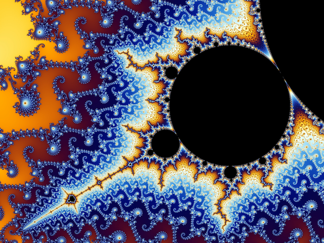

```{r setup, include=FALSE}
knitr::opts_chunk$set(echo = TRUE, 
                      warning = FALSE, 
                      message = FALSE) 

suppressPackageStartupMessages( {
  library(RColorBrewer)
} )
```

# About ***"me"***

## All Thingz Schwemz

"So far as the theories of mathematics are about reality, they are not certain; so far as they are certain, they are not about reality."

  **-Albert Einstein**

"Calculus required continuity, and continuity required the idea of the infinitely little, but nobody could discover what the infinitely little might be." 

  **-Bertrand Russell**



# Mathematics

## Favorite Formulas

### Taylor series raised to power of a matrix $\mathbf{A}$

$e^{\mathbf{A}}=\mathbf{A}^0 + \mathbf{A}^1 + \dfrac{1}{2}\mathbf{A}^2 + \dfrac{1}{6}\mathbf{A}^3 + \dfrac{1}{24}\mathbf{A}^4 + ... + \dfrac{1}{n!}\mathbf{A}^n=$ stable matrix.

### Schrödinger Equation, $i\hslash\dfrac{\delta}{\delta t}|\psi\rangle=H|\psi\rangle$

THe Schrödinger equation in all its glory:

\begin{aligned}
i\hslash\dfrac{\delta}{\delta t}|\psi\rangle=H|\psi\rangle
\end{aligned}, where $|\psi\rangle$ is the *state* of the system as a *vector* (of important parameters such as *position* and *momentum*).

## Pretty Plots

### Taylor Expansion, $cos(x)$

```{r}
## initiate x
x <- seq(-10,10,by=0.2)

## plot
n <- 11
pal <- brewer.pal(11, name="Spectral")
plot(x, cos(x), type="l", col=pal[[7]], lwd=3, ylim=c(-pi,pi))
lines(x, -sin(x), col=pal[[6]])
lines(x, -cos(x), col=pal[[5]])
abline(h=0, v=0, lwd=2)
abline(v=pi, lty=2)
abline(v=-pi, lty=2)

# original solution is 1
abline(h=1, col=pal[[n]], lwd=2)

# 1st derivative solution is 0
abline(h=0, col=pal[[n-1]], lwd=2)

# 2nd derivative solution is -1
abline(h=-1, col=pal[[n-2]], lwd=2)
abline(a=0, b=-1, col=pal[[n-2]], lwd=2)

# taylor expansion
lines(x, (1-(0.5*x^2)), col=pal[[1]], lwd=2)
lines(x, (1-(0.5*x^2)+(1/6)*x^3), col=pal[[2]], lwd=2) # add 3rd term, 1/6 b/c 3*2*1=6
lines(x, (1-(0.5*x^2)+(1/24)*x^4), col=pal[[3]], lwd=2) # add 4th term, 1/24 b/c 4*3*2*1=24
```

### Fourier Transform, $\dfrac{cosn\pi x}{n}$

```{r}
# fourier_step <- function(x, n_iter) {
#   odd_seq <- seq(1, (n_iter*2-1), by=2)
#   for( i in 1:(n_iter-1) ) {
#     assign( paste0("fun_",i), cos(odd_seq[i]*pi*x)/odd_seq[i], envir = .GlobalEnv )
#   }
#   fun_all <- NULL
#   # if i is odd, add
#   n_odds <- odd_seq[c(TRUE,FALSE)]
#   name_odds <- paste0("fun_", n_odds)
#   vec_odds <- lapply(name_odds, get)
#   # if i is even, subtract
#   n_evens <- odd_seq[c(FALSE,TRUE)]
#   name_evens <- paste0("fun_", n_evens)
#   vec_evens <- lapply(name_evens, get)
#   return(vec_evens)
# }

# fourier_step(2, 2)

x <- seq(0, 1, length.out=1e3)
par(font.lab = 2)
plot(x, cos(1*pi*x)/1, type="l", lwd=3.1, col=pal[1], main="Fourier Transform", ylab=expression(cos(n*pi*x)/n))
abline(h=0, v=0, lwd=3)
lines(x, (cos(1*pi*x)/1)-(cos(3*pi*x)/3), type="l", lwd=3, col=pal[2])
lines(x, (cos(1*pi*x)/1)-(cos(3*pi*x)/3)+(cos(5*pi*x)/5), type="l", lwd=2.9, col=pal[3])
lines(x, (cos(1*pi*x)/1)-(cos(3*pi*x)/3)+(cos(5*pi*x)/5)-(cos(7*pi*x)/7), type="l", lwd=2.8, col=pal[4])
lines(x, (cos(1*pi*x)/1)-(cos(3*pi*x)/3)+(cos(5*pi*x)/5)-(cos(7*pi*x)/7)+(cos(9*pi*x)/9), type="l", lwd=2.7, col=pal[5])
lines(x, (cos(1*pi*x)/1)-(cos(3*pi*x)/3)+(cos(5*pi*x)/5)-(cos(7*pi*x)/7)+(cos(9*pi*x)/9)-(cos(11*pi*x)/11), type="l", lwd=2.6, col=pal[6])
lines(x, (cos(1*pi*x)/1)-(cos(3*pi*x)/3)+(cos(5*pi*x)/5)-(cos(7*pi*x)/7)+(cos(9*pi*x)/9)-(cos(11*pi*x)/11)+(cos(13*pi*x)/13), type="l", lwd=2.5, col=pal[7])
lines(x, (cos(1*pi*x)/1)-(cos(3*pi*x)/3)+(cos(5*pi*x)/5)-(cos(7*pi*x)/7)+(cos(9*pi*x)/9)-(cos(11*pi*x)/11)+(cos(13*pi*x)/13)-(cos(15*pi*x)/15), type="l", lwd=2.4, col=pal[8])
lines(x, (cos(1*pi*x)/1)-(cos(3*pi*x)/3)+(cos(5*pi*x)/5)-(cos(7*pi*x)/7)+(cos(9*pi*x)/9)-(cos(11*pi*x)/11)+(cos(13*pi*x)/13)-(cos(15*pi*x)/15)+(cos(17*pi*x)/17), type="l", lwd=2.3, col=pal[9])
lines(x, (cos(1*pi*x)/1)-(cos(3*pi*x)/3)+(cos(5*pi*x)/5)-(cos(7*pi*x)/7)+(cos(9*pi*x)/9)-(cos(11*pi*x)/11)+(cos(13*pi*x)/13)-(cos(15*pi*x)/15)+(cos(17*pi*x)/17)-(cos(19*pi*x)/19), type="l", lwd=2.1, col=pal[10])
lines(x, (cos(1*pi*x)/1)-(cos(3*pi*x)/3)+(cos(5*pi*x)/5)-(cos(7*pi*x)/7)+(cos(9*pi*x)/9)-(cos(11*pi*x)/11)+(cos(13*pi*x)/13)-(cos(15*pi*x)/15)+(cos(17*pi*x)/17)-(cos(19*pi*x)/19)+(cos(21*pi*x)/21), type="l", lwd=2, col=pal[11])
```

## Notes

## Essence of calculus

[Essence of Calculus](20220822_essence_of_calculus.html)

## Differential Equations

[Differential Equations](20220823_differential_equations.html)

### Taylor Expansions

[Taylor Expansions](20220816_taylor_expansions.html)

## Non-Linear Dynamics and Chaos

[ChaoOooOOooOoOoooS](20220816_non-linear_dynamics_and_chaos.html)

### Lorenz Attractors

[Lorenz Attractors](20220813_lorenz_attractors_chaos_theory.html)


